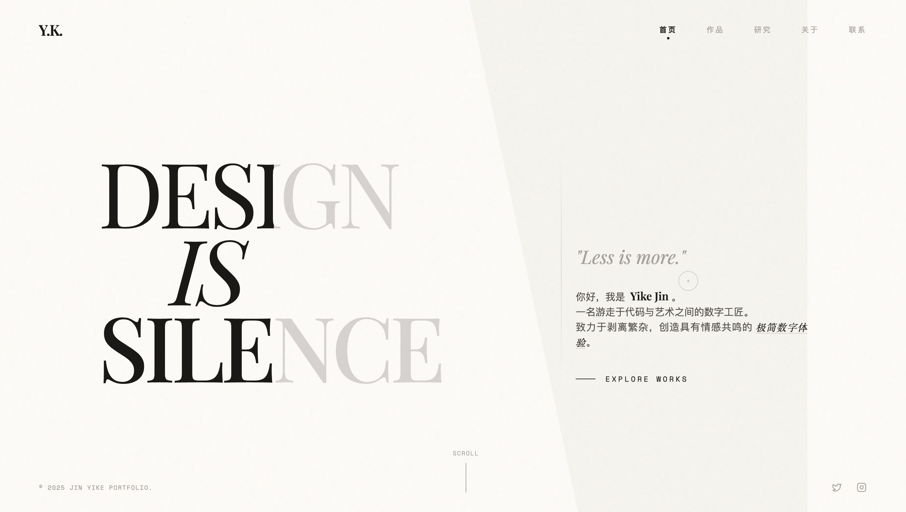
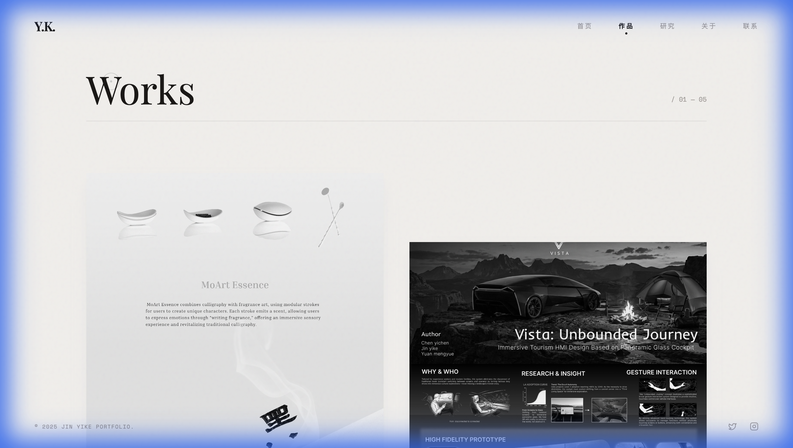
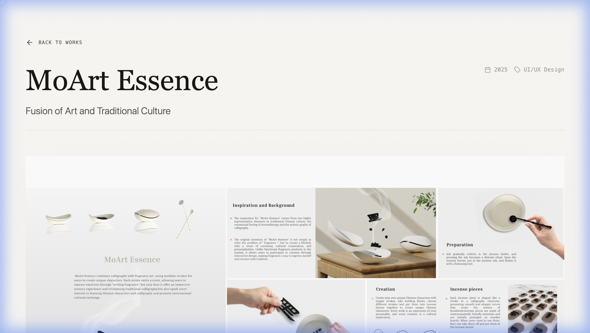

# Jin Yike 个人作品集网站

一个基于 React + Vite + TailwindCSS 构建的现代化个人作品集网站，采用极简主义设计风格，注重视觉层次和交互体验。

**在线预览**：[https://jinyike.vercel.app](https://jinyike.vercel.app)



## 演示视频

<video src="./docs/demo.mov" width="100%" controls></video>

> 📺 **B站观看**：[点击前往 Bilibili](https://www.bilibili.com/video/BV1Bq6oBREBA/)

## 设计亮点

### 开场动画 - 落字效果

网站首页采用独特的**落字动画**设计：当用户进入网站时，"DESIGN" 六个字母会从屏幕顶部依次落下，模拟物理重力效果并带有轻微的弹跳感。点击任意位置即可关闭动画，展现完整的首页内容。这一设计既呼应了 "DESIGN IS SILENCE" 的主题，也为用户创造了难忘的第一印象。

### 核心优势

| 特性 | 说明 |
|-----|-----|
| **极简美学** | 大量留白配合精选字体，营造高端、专业的视觉感受 |
| **流畅动画** | 页面切换、元素进入、悬停效果均有细腻的动画过渡 |
| **沉浸式画廊** | 作品详情页采用居中轮播设计，左右图片虚化处理，突出当前作品 |
| **自定义光标** | 圆环追踪光标，悬停交互元素时有放大反馈 |
| **双色标题** | 首页标题采用黑白双色叠加效果，随滚动产生视差 |
| **响应式布局** | 完美适配从手机到桌面的各种屏幕尺寸 |

## 技术栈

| 技术 | 用途 |
|-----|-----|
| React 18 | 前端框架 |
| Vite 4 | 构建工具 |
| TailwindCSS 3 | 样式框架 |
| React Router 7 | 路由管理 |
| Lucide React | 图标库 |

## 项目结构

```
Portfolio/
├── public/              # 静态资源
│   └── portfolio/       # 作品图片目录
├── src/
│   └── data/
│       └── projects.js  # 作品数据配置
├── App.jsx              # 应用入口
├── main.jsx             # 主页面组件
├── Layout.jsx           # 布局组件
├── ProjectDetail.jsx    # 作品详情组件
├── ProjectPage.jsx      # 作品页面路由
├── index.css            # 全局样式
└── tailwind.config.js   # Tailwind配置
```

## 快速开始

### 环境要求

- Node.js 18+
- npm 或 yarn

### 安装依赖

```bash
npm install
```

### 本地开发

```bash
npm run dev
```

访问 http://localhost:5173 查看网站

### 构建生产版本

```bash
npm run build
```

构建产物将输出到 `dist` 目录

## 页面展示

### 作品列表页



### 作品详情页



## 部署

本项目已部署至 Vercel，推送代码后自动构建更新。

如需自行部署，推荐使用 [Vercel](https://vercel.com) 一键部署。

## 许可证

MIT License

---

Made with ❤️ by Jin Yike
